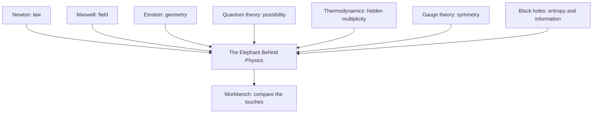
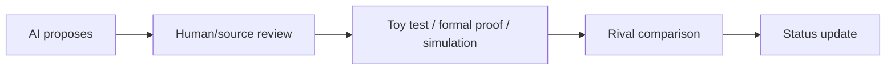
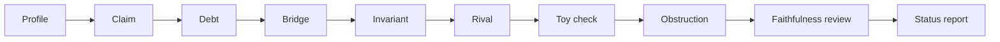
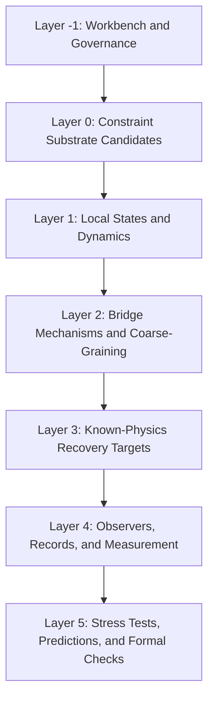
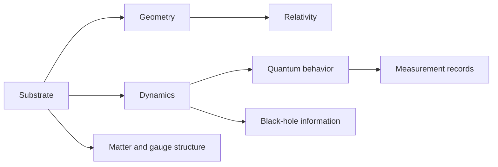
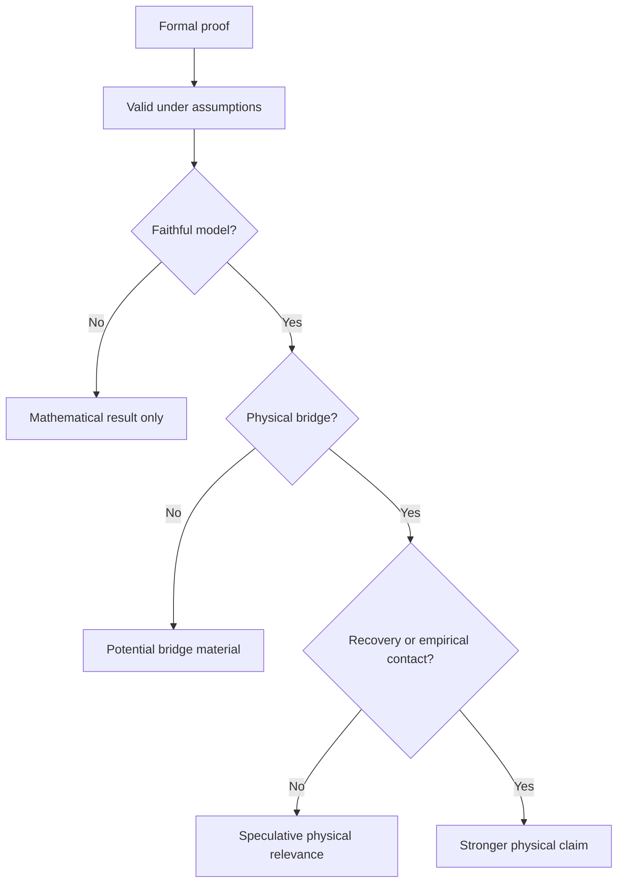

# The Elephant Behind Physics
## How Every Theory Touches Part of Reality — and How We Might Build the Bridge Between Them

**Gani Mendoza**

---

## Dedication

For those who still believe wonder and discipline belong together.

## Epigraph

Every theory is a hand in the dark.  
The work is not to crown the hand,  
but to compare the touch.

---

# Author’s Note
## On Speculation, Proof, and Responsibility

This book contains speculation. That should be said plainly.

It also contains history, explanation, methodology, criticism, and proposed research discipline. But at its frontier, it speculates. It asks whether the great theories of physics may be read as partial contacts with a deeper reality. It asks whether bridges between those theories might be built more carefully. It asks whether tools such as AI, proof assistants, toy models, and structured Workbenches might help organize the search.

These are not finished answers. They are invitations to disciplined inquiry.

The central proposal, **Triadic Bridge Architecture**, or **TBA**, is not presented as an established physical theory. It is not a completed mathematical framework. It is not a verified model of nature. It is not a replacement for general relativity, quantum mechanics, quantum field theory, thermodynamics, or the Standard Model. It is a candidate bridge architecture.

That means its primary value, at this stage, is methodological: it offers a way to handle bold ideas without either dismissing them too quickly or promoting them too cheaply. A reader should not ask, “Has TBA solved physics?” It has not. A better question is: “Does TBA give us a clearer way to state, test, compare, and refine claims about deep physics?”

This book does not claim that spacetime has been derived from a deeper substrate. It does not claim that E8 is the foundation of physical reality. It does not claim that black-hole information has been solved. It does not claim a proof of the Navier–Stokes existence and smoothness problem. It does not claim a proof of the Yang–Mills existence and mass gap problem. It does not claim that artificial intelligence can independently discover and validate final physics. It does not claim that Lean or any proof assistant can certify physical truth without interpretation and empirical contact.

The whole purpose of the Workbench is to prevent exactly those overclaims.

Speculation is not the enemy of science. Undisciplined speculation is. Every major theory begins before it is complete. To forbid speculation would be to forbid beginnings. But to confuse speculation with knowledge would destroy trust. The Workbench exists between those errors. It allows seeds to enter. It does not call them trees. It allows toy models to teach. It does not call them worlds. It allows mathematical jewels to shine. It does not crown them as kings. It allows AI to assist. It does not let AI promote itself.

The posture of this book is simple: **bold entry, slow promotion**. Ideas may enter freely. Promotion must be earned.

---

# Preface
## Why This Book Exists

This book began with a suspicion.

Not a proof. Not a finished theory. Not a secret equation. A suspicion.

Perhaps the great theories of physics are not simply rivals fighting for a final throne. Perhaps each one touches part of something larger. Newton touches law. Maxwell touches field. Einstein touches geometry. Quantum theory touches possibility. Thermodynamics touches hidden multiplicity. Gauge theory touches symmetry. Black holes touch the strange seam where geometry, entropy, quantum theory, and information meet.

Each theory may be incomplete. Each may still contain something real. The question is how to keep the real part without worshiping the whole.

The title, *The Elephant Behind Physics*, comes from the old parable of the blind men and the elephant. One touches the leg and says the elephant is a pillar. Another touches the ear and says it is a fan. Another touches the tail and says it is a rope. Another touches the tusk and says it is a spear. Each report contains contact. Each report becomes false when treated as the whole.

Physics can be read this way. Not because physicists are blind in any simple sense, but because every theory has a boundary. Newton does not survive unchanged at the speed of light or near a black hole. Classical physics does not survive unchanged inside the atom. General relativity and quantum theory both succeed brilliantly, yet they do not fit together cleanly. Quantum field theory describes particles and forces with extraordinary power, yet some of its deepest mathematical foundations remain difficult. Black holes still ask questions we cannot fully answer.

This book asks how we might build bridges between the touches.

TBA is not a theory of everything. It is a disciplined workshop for bold ideas. It asks every speculative claim to become clearer: What exactly is being claimed? What is the bridge? What is preserved across the bridge? What rival could do the same thing? What obstruction might block it? What would make it weaker? What remains unresolved?

These questions prevent a mathematical jewel from becoming an idol. They prevent a toy model from pretending to be the universe. They prevent a simulation from being called proof. They prevent a proof assistant from being mistaken for an oracle of physical truth. They prevent artificial intelligence from turning fluent language into false discovery.

They also protect imagination. Discipline is often treated as imagination’s enemy, but in frontier physics undisciplined imagination burns out quickly. It produces grand claims, beautiful diagrams, confident essays, and fragile castles of language. Disciplined imagination is different. It can survive being made precise.

The book is a hybrid: part popular journey through physics, part Workbench manual. The main chapters are readable and narrative. The appendices gather the method into templates, layer maps, proof-boundary rules, roadmaps, glossary terms, and sample artifact packs.

This book does not ask you to believe TBA. It asks you to practice a way of thinking. When you hear a bold claim, ask what kind of claim it is. When you see a beautiful equation, ask what it maps to. When you encounter a simulation, ask what assumptions it used. When AI gives a brilliant answer, ask what was checked. These questions do not kill wonder. They make wonder trustworthy.

---

# Reader’s Guide
## How to Use This Book

This book is not a textbook, manifesto, or proof of a new theory. It is a guided journey through a question: **How can we think boldly about the foundations of physics without fooling ourselves?**

The book has two intertwined purposes. The first is to tell a story: Newton’s clockwork universe, Maxwell’s fields, Einstein’s spacetime, quantum theory, black holes, Navier–Stokes, Yang–Mills, E8, proof assistants, artificial intelligence, toy models, and the possibility of deeper bridges. The second is to introduce a working discipline: the **Workbench**.

The Workbench asks every bold claim four portable questions:

```text
What exactly is being claimed?
What is the bridge?
What would weaken it?
What remains unresolved?
```

Use these questions while reading physics, listening to lectures, watching videos, evaluating AI answers, studying speculative theories, or testing your own ideas.

The book has eight parts. Parts I and II introduce the great theories and their cracks. Parts III and IV introduce TBA and its layered way of organizing candidate structures, dynamics, bridge mechanisms, recovery targets, observers, and tests. Part V discusses Lean, formal proof, E8, AI, and the conjecture refinery. Part VI shows first crossings through toy models, rivals, obstructions, and prediction cards. Part VII explains maturity, failure, and convergence. Part VIII and the Epilogue gather the final vision.

At the end of each chapter, a compact **Workbench Note** appears:

```text
Main idea:
Bridge:
Obstacle:
Open debt:
```

The notes are not homework. They are a conscience at the end of the story. They remind the reader that wonder is welcome, but promotion must be earned.

---

# Table of Contents

- Author’s Note
- Preface
- Reader’s Guide
- Prologue — The Blind Men and the Light Beam
- Part I — The Great Touches
  - Chapter 1 — The Clockwork Universe
  - Chapter 2 — The Invisible Ocean
  - Chapter 3 — The Boy Who Chased a Beam of Light
  - Chapter 4 — The Stage Becomes an Actor
  - Chapter 5 — The Quantum Rebellion
- Part II — The Cracks in the Cathedral
  - Chapter 6 — The Two Languages That Refuse to Marry
  - Chapter 7 — The Black Hole That Eats the Rules
  - Chapter 8 — The River That Might Become Infinite
  - Chapter 9 — The Field That Refuses to Whisper
  - Chapter 10 — Why Simulation Is Not Proof
- Part III — The TBA Proposal
  - Chapter 11 — What If Space Is Not the Beginning?
  - Chapter 12 — E8: The Jewel, Not the King
  - Chapter 13 — The Bridge Rule
  - Chapter 14 — Plugins in the Workshop
  - Chapter 15 — The Workbench of Reality
- Part IV — Beneath the Smooth World
  - Chapter 16 — The Ants on the Crystal Road
  - Chapter 17 — The Music Without a Metronome
  - Chapter 18 — The Alchemy That Must Not Be Magic
  - Chapter 19 — The World We Must Get Back
  - Chapter 20 — The Click That Becomes a World
  - Chapter 21 — The Theory Must Bleed
- Part V — Machines in the Workshop
  - Chapter 22 — The Machine That Refuses to Bluff
  - Chapter 23 — The Jewel That Was Proved Twice
  - Chapter 24 — The Apprentice in the Infinite Library
  - Chapter 25 — The Conjecture Refinery
- Part VI — First Crossings
  - Chapter 26 — The First Bridge Must Be Small
  - Chapter 27 — A Toy Universe on the Table
  - Chapter 28 — The Boring Rival
  - Chapter 29 — The Cliffs on the Map
  - Chapter 30 — The Wound Written in Advance
  - Chapter 31 — The First Thirty Days
- Part VII — What Survival Would Mean
  - Chapter 32 — From Seed to Serious Contender
  - Chapter 33 — When a Theory Fails Well
  - Chapter 34 — If the Bridges Converge
- Part VIII — The Bridge Ahead
  - Chapter 35 — The Elephant Behind Physics
  - Chapter 36 — The Reader’s Workbench
- Epilogue — The Next Honest Crossing
- Appendices A–H
- Endnotes

---


# Visual Map of the Book







---
# Prologue
## The Blind Men and the Light Beam

Before the equations, before the telescopes and particle colliders and proof assistants, there is a simpler scene.

A group of blind men stand around an elephant. One touches the leg and says the elephant is like a pillar. Another touches the ear and says it is like a fan. Another touches the tail and says it is like a rope. Another touches the tusk and says it is like a spear. Each man reports honestly. Each has touched something real. Each becomes wrong the moment he mistakes the part for the whole.

Physics has often advanced like this. Newton touched law. Maxwell touched field. Einstein touched geometry. Quantum theory touched possibility. Thermodynamics touched hidden multiplicity. Gauge theory touched symmetry. Black holes touched the seam where geometry, entropy, quantum theory, and information meet.

Each theory touched something real. Each changed civilization. None, by itself, has ended the search.

This book begins from that humility. It does not begin by claiming that one new theory has solved the elephant. It begins by asking whether we can compare the touches more carefully. If Newton touched law, Maxwell field, Einstein geometry, quantum theory possibility, thermodynamics multiplicity, and gauge theory symmetry, can we build bridges between these contacts? Can we keep what survives without crowning what fails?

The light beam enters here. Einstein imagined what it would be like to chase a beam of light. What would light look like if you could run beside it? Would the wave freeze? Would Maxwell’s equations survive such a view? That question was simple enough for a child and deep enough to disturb physics. It was not a proof. It was a seed under pressure.

The best scientific imagination works that way. It does not decorate ignorance. It finds a contradiction sharp enough to wound an old picture. Then it follows the wound.

Today we have new tools: enormous libraries, symbolic computation, formal proof assistants, and AI systems that can write fluent explanations of almost anything. The danger is not that we will lack bold ideas. The danger is that bold ideas will become too easy to generate and too hard to judge.

The future needs a Workbench: not a throne room where a theory is crowned too early, but a place where claims are named, bridges are stated, invariants are tracked, rivals are invited, obstructions are recorded, and failures are allowed to teach.

TBA is the candidate framework developed in this book. It is not the final elephant. It is a disciplined way of reaching toward the elephant without pretending we already hold it.

Do not crown the hand that touched the elephant. Build the bridge between the touches.

**Workbench Note**

**Main idea:** Great theories may be partial contacts with a deeper reality.  
**Bridge:** Historical theory → surviving feature → future bridge candidate.  
**Obstacle:** A partial truth becomes false when treated as the whole.  
**Open debt:** TBA must show how partial contacts can be compared without overclaiming.

---
# Part I
## The Great Touches

Physics did not begin with modern equations. It began with the shock that nature could be intelligible at all. The first part of this book follows the great touches: the moments when humanity placed a hand on reality and found structure.

---
# Chapter 1
## The Clockwork Universe

The first great touch was law.

To ancient eyes, the heavens and Earth seemed to belong to different realms. The stars appeared perfect and distant; earthly things fell, burned, broke, and decayed. Modern physics began when that separation collapsed. Galileo studied motion. Kepler found mathematical order in planetary orbits. Newton united the falling apple and the orbiting moon under one law.

This was not merely a technical success. It changed what human beings believed nature was allowed to be. A stone and a planet were not separate categories. They were expressions of one mathematical order.

Newton’s universe was powerful because it was unified. Bodies had positions. Forces changed motion. Time flowed evenly in the background. Space was the stage. If one knew the positions and velocities of all the pieces, the future could, in principle, be calculated. The image was irresistible: a clockwork universe.

The clockwork picture still lives inside us. We use it whenever we expect causes to have effects, objects to continue moving unless disturbed, and equations to predict what happens next. It is not wrong. It is one of the greatest approximations humanity has ever found.

But it is not the whole elephant.

Newton’s gravity acted across empty space. Space and time were assumed, not explained. The stage was fixed. Time was universal. Later physics would wound those assumptions. At high speeds, time refused to remain universal. Near massive bodies, space refused to stay passive. At atomic scales, particles refused to behave like tiny clockwork beads.

Still, Newton was not discarded. He survived as a limit. His laws still guide spacecraft, bridges, engines, tides, and daily motion. This is the first lesson of the elephant: a theory can fail as a final picture and still touch reality deeply.

TBA must respect this. Any deeper framework that cannot recover Newtonian behavior in the right regime is not deeper. It is broken. A new theory earns the right to replace an old one only by explaining why the old one worked.

**Workbench Note**

**Main idea:** Newton touched law: one mathematical order could govern earth and sky.  
**Bridge:** Force law → predictable motion → classical limit.  
**Obstacle:** Absolute space, absolute time, and action at a distance were assumed.  
**Open debt:** Any deeper framework must recover Newtonian mechanics where it works.

---
# Chapter 2
## The Invisible Ocean

The second great touch was field.

A magnet moves iron filings without touching them. A charged object attracts scraps of paper. A current in a wire can disturb a compass needle. To the old mechanical imagination, such effects looked like hidden pulls across empty space.

Michael Faraday changed the picture. He imagined lines of force filling the space around magnets and charges. James Clerk Maxwell turned that intuition into equations. Electricity and magnetism, once separate phenomena, became two faces of a single electromagnetic field. The equations predicted waves traveling at the speed of light. Light itself became electromagnetic.

The world was no longer made only of particles moving through space. It was filled with fields.

A field is not a little object. It is a value spread across space and time. It can vibrate, carry energy, exert force, and propagate. Once the field entered physics, empty space was no longer empty in the old sense.

But the field picture carried a question. If light is a wave, what is waving? Nineteenth-century physicists expected a medium: the ether. Sound waves need air. Water waves need water. Perhaps light waves needed an invisible ocean.

The ether did not survive. Experiments failed to reveal the expected motion through it, and special relativity later made it unnecessary. But the field survived. More than survived: it became one of the central languages of modern physics. Quantum field theory would describe particles as excitations of fields. Gauge theories would describe forces through fields with internal symmetries.

Again the elephant lesson appears. The ether failed. The field survived.

A future Workbench must be able to make exactly this distinction. It should not ask only whether an old worldview was wholly true or false. It should ask what feature had reality-contact: local field degrees of freedom, wave propagation, symmetry, energy flow, and unification.

For TBA, the field is a recovery target. If a candidate substrate or bridge architecture cannot explain why field-like behavior emerges, it has not recovered the world we know.

**Workbench Note**

**Main idea:** Faraday and Maxwell touched field as a real physical language.  
**Bridge:** Local field values → wave propagation → light.  
**Obstacle:** The ether showed how a useful idea can carry a failed interpretation.  
**Open debt:** TBA must recover field-like behavior without smuggling it in.

---
# Chapter 3
## The Boy Who Chased a Beam of Light

Einstein’s great question was childlike: what would the world look like if you could chase a beam of light?

The question was dangerous because it was simple. If light is an electromagnetic wave, and if you could run beside it at the same speed, would you see a frozen wave hanging in space? Maxwell’s equations did not seem to permit such a thing. Old mechanics assumed that speeds simply add and subtract. Something had to give.

Special relativity chose a shocking answer: the speed of light in vacuum is the same for all inertial observers. If that is true, space and time cannot remain the fixed, separate background of Newton’s world. Clocks moving relative to one another do not agree in the old way. Lengths depend on motion. Simultaneity is not absolute.

This sounds like fantasy until one sees the discipline behind it. Einstein was not abandoning lawfulness. He was protecting it. The laws of physics should have the same form for observers moving uniformly relative to one another, and light’s behavior should not depend on a hidden ether frame.

The cost was common sense. The reward was spacetime.

Space and time became woven together. Observers could disagree about distances and durations, but not about a deeper invariant relation. A theory saved objectivity by changing what counted as objective.

That pattern matters for TBA. If spacetime is ever to be explained as emergent, the task is not merely to produce something that looks spatial. It must recover the relational structure that makes special relativity work: light cones, causal order, invariant intervals, and symmetry between inertial frames.

A toy graph with distances is not enough. A discrete substrate with propagation is not enough. A candidate must face the Lorentz obstruction: why do observers not see the seams of the underlying structure? Why is there no obvious preferred frame?

Einstein’s light beam did not solve everything. It identified a pressure point where old concepts had to change. That is what a good thought experiment does. It sharpens the demand for a new bridge.

**Workbench Note**

**Main idea:** Special relativity touched invariant structure beneath observer disagreement.  
**Bridge:** Light-speed invariance → spacetime interval → relativistic physics.  
**Obstacle:** Any deeper substrate risks preferred frames or broken Lorentz behavior.  
**Open debt:** TBA must recover relativistic symmetry rather than assume it.

---
# Chapter 4
## The Stage Becomes an Actor

Special relativity changed space and time. General relativity changed gravity.

In Newton’s universe, space was the stage and gravity was a force acting across it. Einstein asked a different question: what if gravity is not a force in the old sense? What if falling is motion along the natural paths of curved spacetime?

The seed was the equivalence principle. A person in a sealed elevator cannot easily distinguish between being pulled by gravity and being accelerated upward. This simple observation led to one of the deepest shifts in physics: gravity and geometry are intertwined.

Mass and energy tell spacetime how to curve. Curved spacetime tells matter how to move. The stage became an actor.

General relativity explained Mercury’s anomalous perihelion precession, predicted the bending of light by gravity, and later became the language of black holes, gravitational waves, and modern cosmology.[^1]

But general relativity carries its own boundary. Its equations can lead to singularities, places where curvature becomes infinite and the theory seems to announce its own incompleteness. It treats spacetime as smooth. It does not naturally include quantum uncertainty.

This is where the elephant becomes difficult. Einstein touched geometry, but quantum theory touches something else. Both touches are real. Their overlap is not fully understood.

TBA must therefore treat general relativity with both reverence and pressure. Reverence, because any deeper theory must recover its successes. Pressure, because recovering smooth geometry from a deeper structure is not optional if spacetime is claimed to be emergent.

A bridge from substrate to geometry must answer hard questions. What corresponds to distance? What corresponds to curvature? How does locality arise? Why does the large-scale world obey Einstein’s equations, at least approximately? What fails near singularities or quantum regimes?

The curved stage teaches a severe lesson. It is not enough to say that geometry emerges. Geometry is not a picture. It is a structure with equations, symmetries, observables, and limits.

**Workbench Note**

**Main idea:** General relativity touched gravity as geometry.  
**Bridge:** Mass-energy → spacetime curvature → gravitational motion.  
**Obstacle:** Smooth geometry meets singularities and quantum incompatibility.  
**Open debt:** TBA must recover geometric gravity from lower-level structure.

---
# Chapter 5
## The Quantum Rebellion

Classical physics imagined a world with definite properties, continuous motion, and predictable evolution. Quantum theory broke that picture at its root.

The rebellion began quietly. Planck introduced energy quanta. Einstein used light quanta to explain the photoelectric effect. Bohr built a strange atom with discrete orbits. De Broglie suggested matter waves. Schrödinger wrote a wave equation. Heisenberg reformulated mechanics through matrices and uncertainty. Born gave the wavefunction a probabilistic interpretation.

At the center of quantum theory is a strange discipline: possibilities interfere. A particle can behave as though multiple alternatives matter before a measurement occurs. The double-slit experiment makes this vivid. Send particles one at a time through two slits, and an interference pattern still builds up.

Quantum theory is not merely ignorance about hidden clockwork. Bell’s theorem and decades of experiments have made simple local hidden-variable pictures untenable. Nature violates classical expectations in a precise way.

Yet quantum theory is not chaos. It predicts spectra, chemistry, semiconductors, lasers, magnetic resonance, and much of modern technology. Its mathematics is exact enough to build civilization.

Still, interpretation remains unsettled. What is the wavefunction? What exactly happens in measurement? Why do definite outcomes appear? Decoherence explains much about why interference becomes inaccessible in macroscopic systems, but it does not settle every interpretive question.

For TBA, quantum theory is not optional. A deeper framework must recover amplitudes, interference, entanglement, probability, and measurement records. It cannot merely say, “underneath, everything is classical,” unless it can explain why quantum violations of classical assumptions arise.

This is one of the most dangerous areas for speculative frameworks. Many proposals reproduce quantum-sounding words: information, entanglement, observer, collapse, guidance, branching. But words are not bridges. A bridge must state formal structure, translation rule, invariant, and regime.

**Workbench Note**

**Main idea:** Quantum theory touched possibility, amplitude, entanglement, and measurement.  
**Bridge:** Quantum state → probabilities → observed records.  
**Obstacle:** Interpretation and measurement remain difficult, and classical intuition fails.  
**Open debt:** TBA must recover quantum behavior without reducing it to slogans.

---
# Part II
## The Cracks in the Cathedral

The great theories are not weak. They are magnificent. That is why their cracks matter. The deepest problems arise not where physics has failed completely, but where its strongest structures refuse to fit together.

---
# Chapter 6
## The Two Languages That Refuse to Marry

General relativity speaks the language of smooth geometry. Quantum theory speaks the language of states, operators, amplitudes, and probabilities. Each language works. Together, they do not yet form a single clear sentence.

In general relativity, spacetime is dynamic. It bends, stretches, curves, and responds to energy. In ordinary quantum theory, spacetime is usually the stage on which quantum events occur. Quantum fields live on spacetime. Measurements happen at times and places. The background is assumed even when the fields are uncertain.

But if spacetime itself is subject to quantum uncertainty, what becomes of the stage?

This is not a philosophical puzzle alone. It appears in extreme regimes: the early universe, black-hole interiors, singularities, and perhaps the deepest structure of horizons. There the smooth geometry of Einstein and the quantum rules of microscopic physics must both matter.

Many research programs have tried to build the marriage. String theory replaces point particles with extended objects and naturally includes gravity. Loop quantum gravity quantizes geometric degrees of freedom. Causal set theory begins with discrete causal order. Tensor networks suggest that geometry may be related to entanglement patterns. Holography relates gravitational theories in a volume to quantum theories on a boundary in special settings.

Each approach may touch something real. Each faces obstructions.

The Workbench posture is not to ask too early which program is final. It asks what each program contributes. Does it preserve unitarity? Does it recover geometry? Does it explain entropy? Does it handle locality? Does it make contact with known physics? Does it hide assumptions?

TBA is a bridge architecture rather than a single mechanism. It begins from the possibility that no existing program should be swallowed whole, but many may contain surviving features. The two languages that refuse to marry may require a deeper grammar. A deeper grammar must explain why both old languages worked.

**Workbench Note**

**Main idea:** General relativity and quantum theory are both successful but not unified.  
**Bridge:** Geometry language ↔ quantum language.  
**Obstacle:** Spacetime is dynamic in GR but often background in quantum theory.  
**Open debt:** TBA must recover both languages without hiding one inside the other.

---
# Chapter 7
## The Black Hole That Eats the Rules

A black hole is where physics gathers its debts.

Classically, a black hole is simple: mass, charge, spin. Cross the horizon, and no signal returns. But quantum theory refuses to let the story remain simple.

Jacob Bekenstein argued that black holes should have entropy. Stephen Hawking showed that black holes radiate thermally, with a temperature related to their surface gravity.[^2] A black hole, the darkest object in classical physics, glows quantum mechanically. Its entropy is proportional not to volume, but to horizon area.

This area law is one of the great clues in modern physics. It suggests that the number of hidden degrees of freedom associated with a region may scale unlike ordinary matter. Geometry, thermodynamics, quantum theory, and information meet at the horizon.

Then comes the paradox. If Hawking radiation is purely thermal, what happens to the information about what fell in? Quantum theory insists that evolution should preserve information in a precise sense. Classical black-hole evaporation seems to erase it. Something must give: locality, the horizon’s innocence, the meaning of interior, or our assumptions about quantum gravity.

Many mechanisms enter here: holography, string-theoretic fuzzballs, island formulas, Page curves, loop-quantum horizon states, tensor networks, and guidance-history ideas. TBA should not crown one mechanism prematurely. It should turn each into a plugin with a job.

The black-hole information problem punishes vague language. “Information is preserved” is not enough. Where is it encoded? How is it recovered? What subsystem contains it? What observer can access it? What is the map from microstates to macroscopic observables?

A toy model may compare thermal-loss, reversible scrambling, code-recovery, and guidance-history mechanisms. But a toy model remains a toy. It may show how information can be preserved in a finite system. It does not prove astrophysical black holes work that way.

**Workbench Note**

**Main idea:** Black holes force gravity, quantum theory, entropy, and information into one problem.  
**Bridge:** Horizon geometry → microstates → entropy/information behavior.  
**Obstacle:** Different mechanisms can reproduce partial features while hiding assumptions.  
**Open debt:** TBA must compare black-hole information plugins through explicit toy and recovery tests.

---
# Chapter 8
## The River That Might Become Infinite

A river looks smooth from a distance. Up close, it curls, folds, swirls, and breaks into turbulence. The equations that describe fluid motion are old, beautiful, and difficult.

The Navier–Stokes equations govern the flow of fluids such as water and air. They are used in engineering, weather, aerodynamics, and countless simulations. Yet one of the Clay Mathematics Institute Millennium Prize Problems asks whether smooth solutions to the three-dimensional incompressible Navier–Stokes equations always remain smooth, or whether singularities can form under certain conditions.[^3]

This is not because engineers cannot calculate fluids. They can. It is because mathematical proof demands something stronger than usefulness.

A simulation may show a flow behaving well. A physical fluid may avoid literal infinities because real matter has molecular structure. A numerical method may regularize small scales. None of that by itself proves that the ideal continuum equations never blow up.

This distinction matters for TBA. Suppose someone says: “If space is discrete at small scales, then Navier–Stokes singularities are impossible.” Physically, a cutoff may prevent literal infinities. But the Millennium problem asks a precise mathematical question about continuum equations. A discrete story may be relevant to physical fluids, but it does not automatically prove the continuum theorem.

Navier–Stokes is therefore a gate of humility. It teaches that a problem can be physically intuitive and mathematically unforgiving. It also teaches why bridge claims must state their target. Are we trying to explain real fluids? Prove a PDE theorem? Build a toy model of turbulence? Each target carries different obligations.

A responsible TBA claim might say: “A discrete or relational substrate may provide a physical ultraviolet cutoff relevant to fluid-like effective behavior.” An invalid overclaim would say: “Therefore TBA solves Navier–Stokes.” It does not.

**Workbench Note**

**Main idea:** Navier–Stokes separates physical intuition from mathematical proof.  
**Bridge:** Fluid equations → continuum behavior → possible singularity question.  
**Obstacle:** Discrete physical cutoffs do not automatically solve continuum PDE problems.  
**Open debt:** TBA must distinguish physical regularization from mathematical proof.

---
# Chapter 9
## The Field That Refuses to Whisper

Maxwell’s electromagnetic field is already profound. Yang–Mills theory makes the field stranger.

In electromagnetism, the gauge symmetry is abelian. Yang–Mills theory generalizes gauge fields to non-abelian symmetries, where the field can interact with itself. This self-interaction is central to the strong force and quantum chromodynamics.

The mystery is that the theory appears to have a mass gap: a lowest positive energy above the vacuum. Experiment and computation strongly suggest such behavior, but the Clay Mathematics Institute’s Yang–Mills existence and mass gap problem asks for a rigorous proof that a nontrivial quantum Yang–Mills theory exists on four-dimensional Euclidean space and has a mass gap.[^4]

This is one of the deepest places where physics works and mathematics still demands more.

For TBA, Yang–Mills is both warning and target. It is a warning because words like “gap,” “field,” “symmetry,” and “confinement” can be used loosely. A finite graph may have a spectral gap. A toy model may confine a signal. A lattice simulation may show mass-like behavior. None of this is automatically the Yang–Mills mass gap.

It is a target because any framework claiming to reach fundamental physics must eventually face gauge symmetry. Matter comes with charges, representations, interactions, anomaly constraints, chirality, generations, masses, and mixings. A beautiful substrate that cannot recover gauge structure remains far from the Standard Model.

TBA should treat Yang–Mills as a profile, not a trophy. It can map the proof landscape: constructive quantum field theory, Euclidean measures, axioms, gauge invariance, reflection positivity, renormalization, Wilson loops, confinement, and spectral gaps. But it must not claim a solution.

A responsible claim might say: “This candidate dynamics exhibits a finite-model spectral gap under these assumptions and may serve as a toy for later gauge-recovery study.” A reckless claim would say: “This solves Yang–Mills.”

**Workbench Note**

**Main idea:** Yang–Mills is both a physical success and a rigorous mathematical challenge.  
**Bridge:** Gauge symmetry → quantum fields → mass gap/confinement behavior.  
**Obstacle:** Toy spectral gaps are not the Yang–Mills mass gap.  
**Open debt:** TBA must treat Yang–Mills as a proof landscape, not a claimed victory.

---
# Chapter 10
## Why Simulation Is Not Proof

A simulation can be beautiful. It can reveal patterns no one expected. It can make a toy universe breathe on the screen. It can show waves, collisions, turbulence, collapse, emergence, and order.

But a simulation is not a proof.

This does not make simulation weak. It makes simulation specific. A simulation explores the behavior of a model under chosen rules, parameters, approximations, discretizations, and numerical methods. It can suggest conjectures, expose failures, compare rivals, and guide intuition. It can even provide strong evidence in practical settings.

But it does not, by itself, establish that the model describes nature. It also does not prove that a behavior is necessary unless accompanied by mathematical argument.

This distinction becomes urgent in speculative physics. A person can build a cellular automaton, graph dynamics, tensor network, lattice model, or agent-based world and watch complex behavior appear. It is tempting to say: “Look, spacetime emerges.” Or “Look, quantum behavior appears.” The Workbench slows the sentence.

What exactly appeared? In what model? Under what assumptions? What was measured? What was built in? What rival was tested? Did the result survive perturbation? Was the code correct? Is there a theorem? Is there empirical contact?

Simulation is exploration. Proof is necessity under assumptions. Experiment is contact with nature. Interpretation is the bridge between formal structure and physical meaning.

AI makes this discipline even more important. A language model can generate plausible code, plausible explanations, and plausible theorems. It can make a simulation sound meaningful before anyone has checked what it actually tests.

If simulation shows a pattern, the next step is not proclamation. The next step is a toy-check report, a null model, a faithfulness review, and perhaps a formal proof obligation.

**Workbench Note**

**Main idea:** Simulation, proof, experiment, and interpretation are different kinds of support.  
**Bridge:** Model rules → computational behavior → possible conjecture.  
**Obstacle:** Visual complexity can masquerade as physical truth.  
**Open debt:** TBA must label evidence status and require faithfulness reviews.

---
# Part III
## The TBA Proposal

The old theories touched something real. The cracks show that no single touch is enough. TBA begins from a simple proposal: do not crown one touch too early. Build disciplined bridges between them.

---
# Chapter 11
## What If Space Is Not the Beginning?

Most of us imagine space as the container of everything. Things are inside it. Events happen within it. Distances measure separation. Time carries change forward. But what if space is not the beginning?

Many modern ideas suggest that spacetime may not be fundamental in the ordinary sense. In some approaches, geometry appears from entanglement. In others, causal order comes before distance. In still others, strings, loops, graphs, networks, algebraic structures, or quantum information play deeper roles.

The word often used is **emergence**. Emergence is familiar: temperature emerges from microscopic motion; a wave emerges from many water molecules; a traffic jam emerges from many cars. The higher-level pattern is real, but it is not fundamental in the same way as the lower-level pieces.

Could spacetime be like that? The idea is seductive. But the Workbench immediately asks: what is the bridge?

“Spacetime emerges from information” is not enough. What information? In what state space? Under what dynamics? How does distance arise? How does locality arise? How do light cones arise? How does curvature arise? Why does general relativity appear at large scales?

TBA organizes the question through layers. It begins with candidate structures and asks whether bridges can recover the world we know. The candidate structure might be a lattice, graph, causal set, tensor network, spin network, algebraic object, or something else. E8 may appear as one candidate witness because of its exceptional symmetry and rigidity. But E8 is not the king. It is one jewel on the bench.

The key is not to pick a beautiful structure and declare victory. The key is to ask what it can do that rivals cannot. If space is not the beginning, then geometry becomes a recovery target. Known physics becomes a constraint, not an inconvenience.

**Workbench Note**

**Main idea:** Spacetime may be emergent, but emergence must be operationalized.  
**Bridge:** Candidate substrate → geometric observable → known spacetime behavior.  
**Obstacle:** Emergence can become a slogan if the translation rule is missing.  
**Open debt:** TBA must define explicit substrate-to-geometry bridge contracts.

---
# Chapter 12
## E8: The Jewel, Not the King

E8 is one of the most beautiful objects in mathematics. It is an exceptional Lie group with a root system of astonishing symmetry. Its associated lattice in eight dimensions appears in the optimal packing of equal spheres in eight-dimensional Euclidean space. Maryna Viazovska proved the optimality of the E8 lattice sphere packing in dimension 8, using modular forms and Fourier-analytic methods.[^5] A related proof established the optimality of the Leech lattice in dimension 24.[^6]

This is the kind of mathematics that invites awe. E8 has also appeared in areas of theoretical physics. It is tempting, therefore, to treat it as a secret code. The mind wants the jewel to be the crown.

This book resists that temptation. E8 is the jewel, not the king.

A mathematical object may be beautiful, rigid, optimal, and deeply connected without being the foundation of physical reality. Mathematical certainty is not physical ontology. To move from E8 to physics, one needs a bridge.

What physical observable is explained? What maps from E8 structure to that observable? What invariant is preserved? What rival structures have been tested? Does E8 recover ordinary dimension? Does it recover Lorentz symmetry? Does it explain gauge structure, chirality, masses, or interactions? Does it make a prediction that could fail?

Without those answers, E8 remains mathematics. Beautiful mathematics. Perhaps useful mathematics. Not yet physics.

In TBA, E8 can be a candidate witness for rigidity, a comparison point in substrate catalogs, an inspiration for toy models, or a test of whether exceptional symmetry produces distinctive spectra or stability. But it must face rivals: generic rigid lattices, random structures, D4/triality structures, Leech-inspired structures, and tensor networks. To honor E8 is not to overclaim it. It is to make its possible role precise enough to survive criticism.

**Workbench Note**

**Main idea:** E8 is mathematically extraordinary but not automatically physical.  
**Bridge:** E8 structure → candidate invariant or observable.  
**Obstacle:** Mathematical beauty can be mistaken for physical explanation.  
**Open debt:** TBA must test E8 against rivals through explicit bridge contracts.

---
# Chapter 13
## The Bridge Rule

A bridge is not a metaphor.

A metaphor says one thing is like another. A bridge says how one description maps to another, what is preserved, where it works, and where it fails. For speculative physics, the difference is everything.

“Spacetime is like a network” is a metaphor. “Given this finite graph, define distance by this rule, measure neighborhood growth by this invariant, compare against these null models, and record these failure modes” is the beginning of a bridge.

A bridge contract should include domain, codomain, translation rule, invariant, assumptions, regime, rivals, failure modes, evidence status, and next debt. The domain is where the bridge begins. The codomain is where it arrives. The translation rule states how objects, states, or quantities move from one side to the other. The invariant tells us what survives the crossing. The regime tells us where the bridge is supposed to work. Rivals prevent self-deception. Failure modes make the claim woundable.

The bridge rule does not make speculation impossible. It makes speculation legible. It also keeps different claims from sliding into one another. A toy bridge is not a recovery program. A recovery program is not a candidate theory. A formal proof about a bridge component is not empirical confirmation. A simulation result is not a theorem. An AI proposal is not reviewed science.

In TBA, progress is measured by bridge quality, not rhetorical height. A modest bridge that clearly maps a graph to a distance-like observable is more valuable than a grand claim that says “reality is information” without specifying anything.

**Workbench Note**

**Main idea:** A bridge must specify translation, invariant, regime, rivals, and failure modes.  
**Bridge:** Metaphor → operational bridge contract.  
**Obstacle:** Vague analogies can sound explanatory without carrying weight.  
**Open debt:** TBA must turn every major claim into a bridge contract.

---
# Chapter 14
## Plugins in the Workshop

A workshop is not a throne room.

In a throne room, one theory is crowned and the others kneel. In a workshop, tools hang on the wall. Some cut, some measure, some clamp, some polish, some warn. A tool is judged by what it does.

TBA treats existing theories and methods as possible plugins. String theory may contribute dualities, consistency constraints, and holographic examples. Loop quantum gravity may contribute quantized geometry and spin-network ideas. Causal set theory may contribute order-before-distance thinking. Tensor networks may contribute entanglement-to-geometry mechanisms. Holography may contribute boundary/bulk reconstruction. Bohmian mechanics may contribute guidance and actualization concepts. Lattice gauge theory may contribute regulated field dynamics. Lean may contribute formal proof. AI may contribute search, extraction, and drafting.

A plugin is not accepted wholesale. It is assigned a job. What does it do? Where does it work? What does it assume? What does it fail to recover? What rival plugin performs the same task? What artifacts support it?

This posture is different from loyalty and dismissal. It does not say “string theory is the answer” or “string theory is useless.” It asks what features survive. It does the same for loop quantum gravity, causal sets, tensor networks, Bohmian mechanics, and others.

Local promotion prevents both cynicism and hype. A plugin can be strong for one bridge and weak for another. A workshop full of tools is not confusion if each tool has a label.

**Workbench Note**

**Main idea:** Existing theories can be treated as plugins rather than enemies or kings.  
**Bridge:** Theory/program → extracted feature → tested plugin role.  
**Obstacle:** Plugin flexibility can become unfalsifiable if roles are vague.  
**Open debt:** TBA must define plugin jobs, rivals, and failure conditions.

---
# Chapter 15
## The Workbench of Reality

The Workbench is a simple idea with severe consequences. Every claim gets a card. Every card gets a status. Every status carries debt.

This may sound bureaucratic. It is not. It is how imagination keeps memory. Without a Workbench, claims drift. “E8 may be useful” becomes “E8 explains reality.” “This toy model preserves information” becomes “black holes are solved.” “AI proposed a bridge” becomes “AI discovered a theory.”

The Workbench interrupts drift. A claim card asks what exactly is being claimed. A debt ledger records what remains unpaid. A bridge contract states the map. An invariant card states what is preserved. A null model asks whether a boring rival does the same work. An obstruction record names the cliff. A faithfulness review asks whether the model really tests the claim. A prediction card writes the wound in advance. A status report remembers what happened.

The Workbench does not decide final truth. It improves judgment. It can downgrade claims without destroying them. It can promote a toy result locally. It can preserve a failed idea’s surviving feature. It can separate mathematical proof from physical interpretation. It can label AI output as unreviewed.

TBA needs this because its scope is dangerous. It touches spacetime, quantum theory, black holes, E8, AI, proof, gauge theory, and foundational mathematics. Without discipline, such scope becomes fantasy. With discipline, it becomes a research map.

**Workbench Note**

**Main idea:** The Workbench makes claims trackable, reviewable, and downgradeable.  
**Bridge:** Raw idea → typed artifact → tested status.  
**Obstacle:** Accounting can become busywork if it replaces testing.  
**Open debt:** TBA must keep the Workbench light enough to use and strong enough to prevent overclaim.

---
# Part IV
## Beneath the Smooth World

The world appears smooth. Roads, rivers, fields, clocks, and stars all seem to live in continuous space and time. But smoothness may be an effective surface. Beneath it may lie structure we do not yet see.

---
# Chapter 16
## The Ants on the Crystal Road

Imagine ants walking on a crystal road. From far away, the road looks smooth. Up close, it is patterned. If the ants are small enough or sensitive enough, they may notice preferred directions, gaps, repeating cells, or hidden symmetries.

A discrete substrate for physics faces a similar danger. It is easy to say spacetime might be built from discrete pieces. It is harder to explain why we do not see the seams. If the underlying structure is a simple grid, motion in one direction may differ subtly from motion in another. Light may propagate differently along grid axes. High-energy particles may reveal preferred frames.

Nature has not made such violations obvious. Therefore a candidate substrate must pass admissibility tests. It must have enough structure to support bridges, enough symmetry or effective symmetry to hide its scaffolding, enough stability to survive perturbations, and enough recovery potential to approach known physics.

TBA begins with a candidate catalog rather than a single favorite: E8-inspired structures, Leech-inspired structures, D4/triality structures, generic rigid lattices, random lattices, spin networks, causal sets, tensor networks, reversible automata, and finite relational graphs. Each candidate gets a role. Some are favored witnesses. Some are rivals. Some are boring baselines.

The ants on the crystal road teach the first substrate obstruction: if the road has seams, why do the ants not see them? TBA must answer not by hiding the seams verbally, but by showing how effective smoothness, isotropy, locality, and relativistic behavior can arise.

**Workbench Note**

**Main idea:** Candidate substrates must explain why hidden structure does not visibly break known symmetries.  
**Bridge:** Discrete/relational substrate → smooth effective geometry.  
**Obstacle:** Preferred directions, locality collapse, and visible seams.  
**Open debt:** TBA must define admissibility criteria for candidate substrates.

---
# Chapter 17
## The Music Without a Metronome

A substrate alone does not make a world. It needs dynamics.

But dynamics introduces a deep danger. If a framework claims that time is emergent, it cannot quietly use ordinary time as the engine underneath. That would explain time by assuming it.

A simple model might say: at each tick, every node updates according to a rule. But what is the tick? Is it physical time? Is it only a computational parameter? How does the tick become the time measured by clocks? If the model assumes a universal update order, does it introduce a preferred frame?

These questions do not forbid toy models. They clarify their status. A finite automaton can be useful even if its update step is not yet physical time. It can test reversibility, information preservation, propagation, or coarse-graining. But it should not claim to have derived time unless it explains how physical temporal observables arise.

TBA treats dynamics as a plugin layer. Possible plugins include spin-network transitions, spin foams, causal-set growth, tensor-network evolution, Bohmian guidance, lattice gauge dynamics, reversible cellular automata, and constraint-based histories.

The Workbench response is to separate toy time from physical time. Toy time may be useful for computation. Physical time must be recovered through observables, records, clocks, and symmetry.

**Workbench Note**

**Main idea:** Dynamics is necessary, but background time may be an illicit assumption.  
**Bridge:** Local transition rule → effective temporal behavior.  
**Obstacle:** Toy update steps can masquerade as physical time.  
**Open debt:** TBA must distinguish computational evolution from recovered physical time.

---
# Chapter 18
## The Alchemy That Must Not Be Magic

Emergence often sounds like alchemy: take many small pieces, stir them together, and out comes smooth geometry, fields, gravity, thermodynamics, and perhaps consciousness.

The word “emergence” can inspire. It can also conceal. In physics, emergence becomes meaningful only when the transformation is specified. What is coarse-grained? What is averaged? What is preserved? What disappears? What remains stable across scales? What equations appear in the limit?

A gas gives a clear lesson. Temperature is not a property of one molecule. It is a collective property of many. But the bridge is not magic. Statistical mechanics explains how microscopic motion relates to macroscopic thermodynamics.

TBA needs the same standard. Layer 2 is bridge mechanisms and coarse-graining. Possible mechanisms include spectral lifting, entanglement renormalization, holographic reconstruction, theta-series dictionaries, extremal packing or coding correspondences, domain-wall projection, actualization/guidance, and effective continuum limits. Each may be useful. None is magic.

If the desired continuum equation is imposed at the top, it has not been derived. If coarse-graining washes away the very structure the theory depends on, the bridge fails. Smoothness alone is not enough. The right smooth behavior must appear: local, stable, field-like, quantum-consistent, and empirically constrained.

**Workbench Note**

**Main idea:** Emergence and coarse-graining require explicit preservation rules.  
**Bridge:** Microstructure → coarse-grained observable → effective law.  
**Obstacle:** “Emergence” can hide arbitrary averaging or built-in results.  
**Open debt:** TBA must define bridge mechanisms with invariants and failure modes.

---
# Chapter 19
## The World We Must Get Back

A deeper theory does not earn seriousness by being strange. It earns seriousness by explaining why the known world works.

This is recovery. Newtonian mechanics must return in the slow, weak-gravity limit. Special relativity must return where gravity is negligible and speeds matter. General relativity must return for large-scale gravitational phenomena. Quantum mechanics must return for microscopic systems. Quantum field theory must return for particles and fields. Thermodynamics must return for macroscopic matter. Gauge theory must return for the Standard Model. Measurement records must return for laboratories and observers.

Recovery is not optional. It prevents speculative theories from floating away.

TBA organizes recovery targets: Lorentz behavior, semiclassical gravity, quantum theory and unitarity, gauge symmetry and matter structure, black-hole entropy, continuum effective behavior, observer records, and thermodynamics.

A candidate may begin with a toy bridge, but eventually it must climb toward recovery. A graph-distance model may support a distance-like observable, but it must later face dimension, locality, propagation, Lorentz symmetry, and curvature. An E8-inspired structure may show spectral regularity, but it must later face gauge groups, chirality, anomaly cancellation, masses, and empirical constraints.

Recovery also prevents cheating. If a model claims to derive general relativity but inserts Einstein’s equations by hand, recovery is not earned. If it claims to derive quantum theory but assumes Hilbert space, unitary evolution, and the Born rule without explanation, recovery is incomplete.

**Workbench Note**

**Main idea:** New theories must recover known successful physics in proper regimes.  
**Bridge:** Candidate framework → known physical limits.  
**Obstacle:** A model can assume the target and call it recovered.  
**Open debt:** TBA must create recovery reports for each major physics target.

---
# Chapter 20
## The Click That Becomes a World

Physics is not only about equations. It is also about records. A detector clicks. A photographic plate darkens. A pointer moves. A computer logs a bit. An observer remembers an outcome.

Whatever quantum theory means, the world we experience contains definite records. The measurement problem asks how those records arise from quantum possibility.

Decoherence gives part of the answer. A quantum system becomes entangled with its environment, and interference between certain alternatives becomes effectively inaccessible. But decoherence alone does not settle every interpretive question.

Different interpretations offer different plugins: many-worlds, collapse models, Bohmian mechanics, relational approaches, QBism, decoherence, and quantum Darwinism. TBA does not need to decide the interpretation at the start. It needs to ask what any deeper framework must recover: stable records, probabilities, observer-relative descriptions where appropriate, and the transition from microscopic possibility to macroscopic fact.

This is Layer 4: observers, records, and measurement. The word “observer” is dangerous. It can suggest consciousness where only interaction is needed, or erase the real problem of definite records. The Workbench asks more concrete questions: what counts as a record? How is it stored? How stable is it? Who or what can access it? How do probabilities attach to possible records?

A theory that cannot explain the click cannot explain physics, because experiments end in clicks.

**Workbench Note**

**Main idea:** Physics must explain stable records, not only abstract states.  
**Bridge:** Quantum possibilities → measurement interactions → durable records.  
**Obstacle:** Interpretations can reuse the same words while meaning different things.  
**Open debt:** TBA must define observer and record roles without overclaiming consciousness.

---
# Chapter 21
## The Theory Must Bleed

A theory that cannot fail cannot be trusted. This does not mean every early idea must immediately face a laboratory experiment. Some claims are mathematical, computational, toy-level, or methodological. But every claim must have a way to be weakened.

The wound must be written in advance.

Layer 5 contains stress tests, predictions, formal checks, rivals, obstructions, counterexamples, and empirical contact. A prediction card states an observable, a regime, an expected effect, a rival prediction, and a failure condition. A null model asks whether a boring rival can do the same job. An obstruction record names known cliffs: Lorentz recovery, locality, stable dimension, continuum limits, quantum amplitudes, measurement, gauge symmetry, black-hole information, thermodynamic arrow, empirical bounds, and semantic illusion.

Formal proof is also a wound. It forces definitions to become exact. A proof attempt may reveal that a claim was not even well-formed. AI evaluation must also wound the machine. A good AI physics assistant should be tested on invariant extraction, false-bridge detection, executable specification, theorem-obligation drafting, and epistemic humility.

TBA itself must bleed. If its Workbench becomes too cumbersome, it should be simplified. If E8-inspired candidates lose to generic rivals, they should be downgraded. If predictions fail, status should change. The goal is not to protect TBA from criticism. The goal is to make it criticizable in the right ways.

**Workbench Note**

**Main idea:** Claims must expose how they can fail or be weakened.  
**Bridge:** Speculative claim → stress test → status update.  
**Obstacle:** Flexible frameworks can evade falsification by changing language.  
**Open debt:** TBA must write prediction cards and obstruction records before promotion.

---
# Part V
## Machines in the Workshop

New tools have entered the room: proof assistants, AI systems, huge libraries, formal languages, and simulation engines. They can help. They can also mislead. The Workbench must welcome machines without kneeling to them.

---
# Chapter 22
## The Machine That Refuses to Bluff

A proof assistant is a machine that refuses to be charmed. It does not care whether prose is elegant, whether the argument sounds obvious, or whether the author is famous. It asks whether the statement follows from definitions and assumptions by permitted steps.

Lean is an open-source programming language and proof assistant used for formalizing mathematics and verified code.[^7] Its mathematical ecosystem, mathlib, is a large community-driven library of formalized mathematics.[^8]

For TBA, such tools are valuable because speculative frameworks often hide ambiguity. A claim that sounds precise in prose may collapse when formalized. What is a graph? What is distance? What is preservation? What is reversibility? What exactly is being proved?

Formalization forces the question. But proof assistants have a boundary. Lean can check that a theorem follows from assumptions. It cannot by itself decide whether those assumptions describe nature.

This is the proof boundary. A theorem about shortest-path distance in an undirected graph may be perfectly true. It does not prove that physical space is a graph. A theorem about reversible dynamics may be exact. It does not prove that black holes preserve information in our universe.

The machine that refuses to bluff is a gift. It teaches humility: define your terms, state your assumptions, show the steps. Physics then asks the next question: does this formal structure touch the world?

**Workbench Note**

**Main idea:** Proof assistants can check formal claims but not physical interpretation.  
**Bridge:** Informal claim → formal theorem → checked proof.  
**Obstacle:** Formal truth under assumptions can be mistaken for physical truth.  
**Open debt:** TBA must separate formal proof obligations from reality-contact claims.

---
# Chapter 23
## The Jewel That Was Proved Twice

E8 returns here not as a physical foundation, but as a lesson in disciplined certainty.

The sphere packing problem asks how densely equal spheres can be arranged in space. In eight dimensions, the E8 lattice gives an extraordinarily dense and symmetric packing. In 2016, Viazovska proved that the E8 lattice packing is optimal in dimension 8.[^5] Soon after, Cohn, Kumar, Miller, Radchenko, and Viazovska proved the corresponding optimality of the Leech lattice in dimension 24.[^6]

These are mathematical triumphs. They also teach restraint. A sphere-packing theorem proves something exact about arrangements of spheres in Euclidean spaces of specified dimensions. It does not prove that physical space is eight-dimensional, that E8 governs matter, or that the universe is built from a lattice.

In recent years, the sphere-packing story has entered formal verification. Reports in 2026 announced a significant milestone: a sorry-free Lean proof of the E8 optimality theorem, with Math Inc.’s Gauss autoformalization system contributing to final stages.[^9] Math Inc. has also described Gauss as an agent for assisting mathematicians with Lean formalization, including work on a strong Prime Number Theorem formalization challenge associated with Terence Tao and Alex Kontorovich.[^10]

These developments are important, but they should be read carefully. AI-assisted formalization is not autonomous discovery of physical truth. A formal proof of a mathematical theorem remains a proof within mathematics. Its physical meaning, if any, still requires a bridge.

**Workbench Note**

**Main idea:** E8 sphere packing shows the power of proof and formalization.  
**Bridge:** Mathematical theorem → formal proof → possible bridge material.  
**Obstacle:** Verified mathematics can be mistaken for verified physics.  
**Open debt:** TBA must state any physical E8 claim as a separate bridge with rivals.

---
# Chapter 24
## The Apprentice in the Infinite Library

AI now sits in the library with us. It can read quickly, summarize widely, imitate expertise, write code, draft equations, generate analogies, and connect distant topics. It can help a researcher move faster than before. It can also generate fluent fog.

The Workbench assigns AI a role: apprentice, not oracle. An apprentice can fetch tools, draft summaries, list assumptions, compare papers, propose bridges, generate null models, write toy code, suggest proof obligations, and identify obstructions. But an apprentice does not declare truth.

The default label for AI output should be `unreviewed_ai_suggestion`. That label is not an insult. It is a status. A suggestion may become useful after review, sourcing, testing, formalization, or empirical contact. But it should not begin promoted.

AI is especially vulnerable to semantic illusion. It may connect words that sound similar while missing structural differences. “Information” in thermodynamics, quantum theory, black holes, computer science, and ordinary speech may not mean the same thing. “Gap” in a finite matrix spectrum is not automatically the Yang–Mills mass gap.

AI can be extremely useful if the task is shaped correctly. Do not ask it to invent a theory of everything. Ask it to extract claims, separate assumptions, list invariants, propose null models, detect overclaims, draft bridge contracts, generate counterexamples, and state proof obligations. The apprentice can help in the infinite library. But the door to promotion remains guarded.

**Workbench Note**

**Main idea:** AI can accelerate research but must begin as unreviewed assistance.  
**Bridge:** AI output → reviewed artifact → tested status.  
**Obstacle:** Fluency can mimic insight without structure.  
**Open debt:** TBA must evaluate AI on bridge discipline, not only answer generation.

---
# Chapter 25
## The Conjecture Refinery

A raw idea is not a sin. Every theory begins somewhere: a question, analogy, unexpected pattern, mathematical object, failed experiment, or strange thought experiment. The danger is not the seed. The danger is calling it a tree.

The conjecture refinery turns raw ideas into structured claims. It does not guarantee truth. It prevents premature promotion.

A claim enters. It is typed: historical, mathematical, physical, computational, empirical, interpretive, or methodological. Its assumptions are listed. Its evidence status is marked. Its debt is attached. Then the refinery asks for a bridge. If the claim crosses from one domain to another, how? If it invokes an invariant, what is preserved? If it uses a toy model, what does the toy actually test? If it praises a beautiful structure, what rival structures have been compared?

The refinery also protects failure. A failed claim may still leave behind useful residue: an invariant, an obstruction, a toy method, a null model, a better definition, a proof obligation, or a warning.

TBA is not a single bet. It is a method for processing bets. The refinery’s rule is simple: ideas enter free; promotion costs debt.

**Workbench Note**

**Main idea:** Raw ideas become research artifacts through staged refinement.  
**Bridge:** Seed idea → typed claim → tested status.  
**Obstacle:** Strong language can promote a claim before evidence arrives.  
**Open debt:** TBA must make debt visible without letting accounting replace research.

---
# Part VI
## First Crossings

The first bridge should be small. A framework that begins by solving everything usually solves nothing. The first honest crossing is narrow enough to test.

---
# Chapter 26
## The First Bridge Must Be Small

A grand theory wants a grand beginning. Resist that urge. Do not begin by claiming to derive spacetime, matter, gravity, quantum theory, consciousness, and black holes from one beautiful structure. Begin with one bridge small enough to inspect.

For TBA, an example first bridge is `finite relational structure → distance-like observable`. This does not prove spacetime. It tests whether a candidate structure can support one primitive feature needed for later geometry recovery.

The bridge might use a graph. Nodes represent relational units. Edges represent adjacency. A distance-like observable may be defined by shortest-path length, propagation time, spectral distance, or another rule. Then an invariant is measured: neighborhood growth, distance distribution, perturbation stability, or spectral behavior.

The key is to compare rivals. A random graph may produce small-world collapse. A regular lattice may preserve locality but show preferred directions. A generic rigid lattice may perform as well as an exceptional candidate. An E8-inspired structure may or may not show distinctive behavior.

The first bridge must be allowed to fail. If the favored candidate loses to a null model, the result is useful. If the invariant cannot distinguish structures, the invariant is too weak. If the distance rule imposes the desired behavior, the bridge is unfaithful.

The first bridge is not about glory. It is about calibration.

**Workbench Note**

**Main idea:** TBA should begin with inspectable bridge tests, not cosmic claims.  
**Bridge:** Finite structure → distance-like observable.  
**Obstacle:** Small toy success can be inflated into spacetime emergence.  
**Open debt:** TBA must run first-crossing toy checks with null models.

---
# Chapter 27
## A Toy Universe on the Table

Put a toy universe on the table. Not because it is the universe. Because it is small enough to question.

Imagine beads connected by strings. Some beads are neighbors. Others are far apart. Signals can move along strings. Groups of beads can be coarse-grained into larger units. Patterns can be measured. This is a finite graph toy model.

The first question is whether it can produce a distance-like observable. The simplest rule is shortest-path distance. This is clear, but it may be physically weak because it defines distance by graph structure rather than deriving distance from dynamics. A later rule may use propagation time: how many update steps are required for a signal at one node to influence another?

The second question is whether the toy has dimension-like behavior. In ordinary space, the number of points within a radius grows in a characteristic way. A graph may show neighborhood growth. If growth explodes too quickly, locality collapses. If growth is unstable, dimension-like interpretation fails.

Each toy check should state what is omitted: real spacetime, quantum field theory, general relativity, gauge symmetry, black holes, and observers in the full physical sense. A good toy model is honest about its smallness. It is a microscope for a bridge.

**Workbench Note**

**Main idea:** Toy models test narrow mechanisms under visible assumptions.  
**Bridge:** Finite toy structure → measurable bridge behavior.  
**Obstacle:** Toy models omit most of the real physics they may gesture toward.  
**Open debt:** TBA must write faithfulness reviews for every toy result.

---
# Chapter 28
## The Boring Rival

Every beautiful theory deserves a boring rival. The boring rival is not there to be impressive. It is there to ask whether beauty is doing any work.

If an E8-inspired structure produces stable neighborhood growth, compare it with a generic rigid lattice. If a tensor network produces geometry-like behavior, compare it with a simpler network. If a black-hole toy model preserves information, compare it with a generic reversible system. If AI finds a formula, compare it with random search or ordinary regression.

The boring rival protects against decoration. A favored candidate often carries emotional weight. It may be elegant, rare, symmetric, historically meaningful, or personally beloved. The rival has no such glamour. That is its strength.

A null model should be fair. It should match the relevant budget: node count, edge count, parameter count, computational resources, or degrees of freedom. A weak rival proves little. A strong rival sharpens the claim.

If the boring rival wins, the favored candidate is downgraded for that task. If the favored candidate survives a strong rival, its status becomes more credible. The boring rival is the friend who refuses to flatter you.

**Workbench Note**

**Main idea:** Null models reveal whether a beautiful candidate is actually special.  
**Bridge:** Favored explanation ↔ boring rival comparison.  
**Obstacle:** Weak rivals create false confidence.  
**Open debt:** TBA must match rivals fairly before promotion.

---
# Chapter 29
## The Cliffs on the Map

A good map marks cliffs. Speculative physics needs obstruction maps for the same reason.

TBA’s obstruction library should include Lorentz recovery, locality, stable dimension, continuum limit, quantum amplitudes, Born rule, measurement records, gauge symmetry, chirality, anomaly cancellation, Yang–Mills mass gap confusion, black-hole information, thermodynamic arrow, empirical bounds, parameter fitting, and semantic illusion.

Each obstruction records why the problem matters, whether the claim faces it, whether it avoids it by assumption, current response, severity, and next action. Lorentz recovery matters because hidden substrates often introduce preferred frames. Locality matters because random connectivity can make everything close to everything else. Gauge symmetry matters because matter and forces are organized by gauge structure.

Semantic illusion deserves special attention in the AI age. It occurs when similar words create a false bridge. “Information” in black-hole thermodynamics is not automatically the same as information in ordinary computer files.

A cliff is not a refutation. It is a location where debt concentrates. A theory becomes more serious when it faces cliffs directly.

**Workbench Note**

**Main idea:** Obstruction maps identify known failure points before claims are promoted.  
**Bridge:** Candidate claim → known cliff → required response.  
**Obstacle:** A framework can evade hard problems by renaming them.  
**Open debt:** TBA must maintain obstruction records for each major claim.

---
# Chapter 30
## The Wound Written in Advance

A prediction is a wound written in advance. It says: here is where the claim may bleed.

Predictions need not always be immediate laboratory forecasts. Early-stage theories may make toy predictions, formal predictions, simulation predictions, recovery predictions, or empirical predictions. What matters is that the predicted result is not infinitely flexible after the fact.

A prediction card should include observable, regime, expected effect, rival prediction, failure condition, assumptions, test status, and interpretation limits. For a toy graph bridge, the observable might be neighborhood growth stability. The expected effect is that a favored candidate outperforms a random rival. The failure condition is that the rival performs equally well or better.

For empirical physics, predictions become harder and more valuable. Gravitational-wave deviations, neutrino mixing constraints, black-hole spectral signatures, Lorentz-violation bounds, or cosmological signals could become prediction targets only if a framework becomes precise enough.

Prediction cards prevent post-hoc victory. A theory that cannot write any wound may still be a seed. It should not be a contender.

**Workbench Note**

**Main idea:** Prediction cards make claims risk failure before results are known.  
**Bridge:** Claim → expected observable → failure condition.  
**Obstacle:** Post-hoc interpretation can make any result look supportive.  
**Open debt:** TBA must attach prediction cards to promoted bridge claims.

---
# Chapter 31
## The First Thirty Days

A grand research program becomes real only when it has a first month.

The first thirty days of TBA should not attempt to solve quantum gravity. They should build the Workbench and run one small cycle. Begin with a research profile that forbids final-theory language and defines allowed outputs: claim cards, bridge contracts, invariant cards, toy checks, null models, obstruction records, faithfulness reviews, prediction cards, status reports, and formal proof obligations.

Next comes the claim registry. The first claim may be: “A finite relational structure may support a distance-like observable through an explicit translation rule.” Then comes the debt ledger: map, invariant, toy check, null model, obstruction, faithfulness review, prediction card, and perhaps formalization.

Then define the candidate catalog: matched random graph, regular lattice graph, generic rigid lattice, E8-inspired finite structure. Define the bridge: finite graph to distance-like observable. Define the invariant: neighborhood growth stability. Define the null model. Define the toy check. Define failure conditions.

Then run the toy check, write the obstruction record, write the faithfulness review, and produce the first status report. If nothing is promoted, the month may still succeed. The goal is traceability.

**Workbench Note**

**Main idea:** The first month should operationalize one small Workbench cycle.  
**Bridge:** Vision → artifacts → first toy test.  
**Obstacle:** Ambition can pull the project toward premature grand claims.  
**Open debt:** TBA must complete a first status report before expanding.

---
# Part VII
## What Survival Would Mean

A claim survives by earning status. It does not leap from idea to truth. It climbs, falls, mutates, or retires.

---
# Chapter 32
## From Seed to Serious Contender

Not all claims deserve the same status. A seed is a raw idea. It may be exciting, strange, beautiful, or vague. It deserves capture, not belief. A toy model tests a narrow mechanism. It deserves attention, not inflation. A checked model has survived some internal tests, null models, or formal checks. A bridge candidate has an explicit translation rule, invariant, regime, rival, and failure mode. A recovery program attempts to reproduce known physics in a specified domain. A framework coordinates many claims and bridges. A candidate theory proposes a coherent physical picture with nontrivial recovery and prediction. A serious contender survives strong tests, rivals, recovery demands, predictions, and empirical or formal support.

TBA itself should be placed carefully. In this book, it is not a candidate theory of nature. It is a framework and Workbench discipline under development. Some of its components may be seeds. Some may be toy models. Some may become bridge candidates. The whole architecture remains below serious contender status until it achieves major recovery, rival resistance, and prediction.

Maturity status allows partial progress. An E8-inspired candidate may be locally promoted for one spectral toy result and downgraded for geometry recovery. Status is local. This is how the Workbench avoids both cynicism and hype.

**Workbench Note**

**Main idea:** Claims mature through earned stages rather than sudden belief.  
**Bridge:** Evidence and tests → local maturity status.  
**Obstacle:** A claim can borrow status from nearby stronger claims.  
**Open debt:** TBA must track maturity separately for each claim and bridge.

---
# Chapter 33
## When a Theory Fails Well

Failure is not the opposite of progress. Bad failure hides. Good failure teaches.

A theory fails well when it leaves behind a clearer map: an equation that still works, a symmetry worth preserving, an obstruction future theories must face, a toy model that clarified a mechanism, or a boundary where an approximation breaks.

The ether failed as a physical medium, but fields survived. Newtonian absolutes failed at high speed and strong gravity, but Newtonian mechanics survived as a limit. Early atomic models failed in detail, but quantization survived. Classical black holes failed to remain thermodynamically silent, but their geometry became part of a deeper entropy puzzle.

The elephant principle depends on good failure. If we discard failed theories wholesale, we lose surviving features. If we worship them wholesale, we keep failed interpretations. The Workbench asks what survived cross-constraint testing.

A failed TBA bridge might teach that shortest-path graph distance is too artificial. Good. Try propagation-derived distance. A failed E8 toy might teach that rigidity alone is not enough. Good. Compare spectral structure. Failure should update artifacts: claim card, debt ledger, obstruction record, faithfulness review, and status report.

**Workbench Note**

**Main idea:** Failed theories can leave surviving features and useful constraints.  
**Bridge:** Failed claim → extracted survivor → future tool.  
**Obstacle:** People either discard too much or preserve too much.  
**Open debt:** TBA must record failure in ways that future work can reuse.

---
# Chapter 34
## If the Bridges Converge

What would it mean for TBA to gain trust? Not one spectacular claim. Not one beautiful diagram. Not one AI-generated manuscript. Not one toy model. Not even one formal theorem.

Trust would come from convergence. Independent bridges would begin to point in compatible directions. A substrate-to-distance bridge would support stable locality. A propagation bridge would support effective light cones. A coarse-graining bridge would preserve relevant invariants. A quantum bridge would recover amplitudes and probabilities. A geometry bridge would recover curvature in a controlled regime. A matter bridge would begin to face gauge structure. A black-hole bridge would account for entropy and information in a way rivals fail to match.

No single bridge would carry the whole load. The strength would come from mutual constraint.

Convergence also means obstructions shrink rather than move. Lorentz recovery becomes more precise. Locality is not merely asserted. Dimension stabilizes. Continuum behavior improves. Gauge claims face anomaly constraints. Predictions sharpen.

A converging framework should also become less arbitrary. Parameters should not multiply freely. Choices should be explained. Rivals should be tested. Failures should be remembered. The elephant begins to show shape when touches constrain each other.

**Workbench Note**

**Main idea:** Trust grows when independent bridges constrain and support one another.  
**Bridge:** Local bridge successes → cross-constraint convergence.  
**Obstacle:** A framework can look coherent by being too flexible.  
**Open debt:** TBA must show convergence among bridges, not isolated anecdotes.

---
# Part VIII
## The Bridge Ahead

The book began with hands on an elephant. It ends with a Workbench. The future of physics may not be a single proclamation. It may be a long discipline of better crossings.

---
# Chapter 35
## The Elephant Behind Physics

The elephant behind physics is not a creature hiding in space. It is the deeper shape of reality that our theories touch only partially.

Newton touched law. Maxwell touched field. Einstein touched geometry. Quantum theory touched possibility. Thermodynamics touched hidden multiplicity. Gauge theory touched symmetry. Black holes touched the seam between geometry, entropy, quantum theory, and information. Each touch changed the world. Each remains limited.

This book has argued that the next stage of theory-building may require a new habit: not merely inventing theories, but comparing contacts. The goal is not to collect grand stories. It is to extract surviving features and build bridges between them.

TBA is one proposed Workbench for that task. It asks every claim to be typed, every bridge specified, every invariant named, every rival invited, every obstruction recorded, every prediction given a failure condition, every proof kept within its boundary, and every AI output begun as unreviewed.

This is not glamorous in the usual sense. It does not offer instant finality. But it offers something better: a way for wonder to become durable.

When someone proposes that spacetime emerges, the Workbench asks for the bridge. When someone proposes that E8 matters, it asks for the observable. When someone proposes that AI discovered a law, it asks for review. These questions are not acts of disbelief. They are acts of respect.

**Workbench Note**

**Main idea:** Theories should be treated as partial contacts with a deeper reality.  
**Bridge:** Surviving features from theories → disciplined bridge architecture.  
**Obstacle:** The desire for finality can crown a partial touch too soon.  
**Open debt:** TBA must prove its usefulness through actual bridge work.

---
# Chapter 36
## The Reader’s Workbench

The book ends by giving the Workbench away. You do not need to build software to use it. You do not need to be a professional physicist. You need four questions.

```text
What exactly is being claimed?
What is the bridge?
What would weaken it?
What remains unresolved?
```

Use them on popular physics books. Use them on videos. Use them on AI-generated theories. Use them on your own ideas. Use them on this book.

If someone says, “This theory explains everything,” ask what exactly is explained. If someone says, “This simulation proves emergence,” ask what the simulation actually tested. If someone says, “This equation is beautiful,” ask what physical observable it maps to. If someone says, “AI discovered a proof,” ask whether it was checked, by whom, and under what assumptions.

The questions do not make you cynical. They make you useful. A cynical reader dismisses too quickly. A gullible reader accepts too quickly. A Workbench reader clarifies.

The future will contain more claims than ever. AI will generate theories. Software will simulate worlds. Proof assistants will verify theorems. Social media will amplify fragments. Real breakthroughs may appear among the noise. The challenge will be recognition.

A smaller clear idea is more valuable than a large foggy one. It can be tested, revised, connected, and grown. The reader’s Workbench is ultimately a habit of intellectual honesty. It asks wonder to stand in the light.

**Workbench Note**

**Main idea:** The Workbench becomes a portable habit for readers.  
**Bridge:** Spectator → active evaluator of claims.  
**Obstacle:** Both cynicism and gullibility avoid careful judgment.  
**Open debt:** The reader must apply the four questions beyond this book.

---
# Epilogue
## The Next Honest Crossing

Reality does not owe us simplicity.

It is remarkable that we have found as much order as we have. The falling apple and the orbiting moon obey one law. Electricity, magnetism, and light become one field. Space and time become spacetime. Gravity becomes geometry. Matter becomes quantum. Heat becomes statistics. Black holes become thermodynamic. Symmetry becomes force.

These are not small victories. They are signs that the elephant can be touched. But they are not the whole elephant.

The next crossing may come from a new equation, a new experiment, a new duality, a new formal proof, a new AI-assisted search, a new toy model, or a new way to compare old theories. It may come from a place that now looks unfashionable. It may come from a failed theory whose surviving feature has not yet been extracted. It may come from a mathematical jewel that finds the right bridge. It may come from a boring rival that exposes what beauty missed.

We do not know.

That ignorance is not defeat. It is the beginning of discipline.

The next honest crossing will probably be small. It will not say, “Here is the final theory.” It will say: here is a claim, here is the bridge, here is the invariant, here is the rival, here is where it may fail, and here is what remains unpaid.

That may sound modest. But every durable bridge begins with a load-bearing piece.

This book has defended two things at once: wonder and discipline. Wonder without discipline becomes fantasy. Discipline without wonder becomes accounting. Physics needs both. So does the age of AI.

Do not ask the next idea to be final too soon. Ask it to be clear. Ask it to build a bridge. Ask it to face a rival. Ask it to name its wound. Ask it to remember its debt. Then let it try.

The elephant remains larger than our hands. But the next touch can be reported more honestly. And perhaps, one honest crossing at a time, the deeper shape will begin to appear.

**Workbench Note**

**Main idea:** The future requires both wonder and disciplined promotion.  
**Bridge:** Partial theories → honest crossings → deeper shape.  
**Obstacle:** The desire for final answers can destroy the value of beginnings.  
**Open debt:** The next step is implementation: run the Workbench on real claims.

---
# Appendices

The appendices turn the book’s habits into tools. They are optional for narrative readers and practical for builders.

---

# Appendix A
## A Minimal Workbench Manual

The Workbench keeps bold ideas reviewable. Its rule is simple:

```text
Ideas enter free.
Promotion costs debt.
```

## Claim Card

```yaml
claim_id: TBA-0001
title: Relational structure may support distance-like observables
claim_statement: >
  A finite relational structure may support a distance-like observable through
  an explicit translation rule.
claim_type: bridge / toy-model / speculative precursor
maturity_status: Seed
evidence_status: human_hypothesis
assumptions:
  - relational structure can be represented as a finite graph
  - distance-like behavior is relevant to geometry recovery
not_claiming:
  - spacetime has emerged
  - general relativity has been recovered
  - the graph is physically real
current_debt:
  - needMap
  - needInvariant
  - needToyCheck
  - needNullModel
  - needObstruction
  - needFaithfulnessReview
next_action: Create a bridge contract.
```

## Maturity Status

```text
Seed
Toy Model
Checked Model
Bridge Candidate
Recovery Program
Framework
Candidate Theory
Serious Contender
Downgraded
Obstructed
Retired
```

## Evidence Status

```text
unreviewed_ai_suggestion
human_hypothesis
literature_claim
mathematical_definition
proof_sketch
formal_proof
simulation_result
toy_model_result
post_hoc_fit
predeclared_prediction
empirical_observation
experimental_result
failed_test
reviewed_artifact
```

## Debt Ledger

```yaml
claim_id: TBA-0001
debt_item: needNullModel
why_it_matters: >
  The favored candidate may not be special unless it beats a fair rival.
required_artifact: Null Model
status: unpaid
next_action: Compare against a matched random graph.
```

## Bridge Contract

```yaml
bridge_id: BRIDGE-0001
domain: finite graph
codomain: distance-like observable
translation_rule: shortest-path distance
invariant: neighborhood growth stability
regime: finite toy structures
rivals:
  - matched random graph
  - regular lattice
failure_modes:
  - locality collapse
  - rival performs equally well
  - distance rule imposes desired behavior
evidence_status: proposed
```

## Invariant Card

```yaml
invariant_id: INV-0001
name: Neighborhood growth stability
definition: >
  Count nodes reachable within k steps from each node and compare growth curves.
why_it_matters: First proxy for locality and dimension-like behavior.
failure_condition: Candidate collapses into small-world behavior or matches random rival.
```

## Toy Check

```yaml
toy_id: TOY-0001
question: Can finite graphs support stable distance-like observables?
procedure:
  - construct candidate and rival graphs
  - compute distance matrices
  - compute neighborhood growth
  - compare against null models
omits:
  - physical spacetime
  - quantum theory
  - general relativity
  - continuum limit
interpretation_limit: Toy-level support only.
```

## Prediction Card

```yaml
prediction_id: PRED-0001
observable: neighborhood growth stability
regime: matched finite graphs
expected_effect: favored candidate outperforms random graph
rival_prediction: random graph may show comparable growth
failure_condition: rival performs equally well or better
test_status: open
```

---

# Appendix B
## The TBA Layer Stack



Layer -1 keeps the research honest: claim registries, debt ledgers, evidence labels, human review, AI-output status, and promotion rules.

Layer 0 holds candidate structures: E8-inspired structures, Leech-inspired structures, D4/triality structures, generic rigid lattices, random graphs, spin networks, causal sets, tensor networks, finite relational graphs, and reversible automata.

Layer 1 asks how candidate structures change or constrain histories: state spaces, transition rules, causal growth, spin foams, tensor-network evolution, Bohmian guidance, lattice gauge dynamics, reversible updates, and constraint systems.

Layer 2 builds maps from lower-level structure to higher-level observables: spectral reconstruction, entanglement renormalization, holographic reconstruction, coarse-graining, theta-series dictionaries, and effective continuum limits.

Layer 3 asks whether known physics can be recovered: Newtonian mechanics, special relativity, general relativity, quantum mechanics, quantum field theory, gauge theory, thermodynamics, black-hole entropy, and continuum behavior.

Layer 4 asks how definite records appear: measurement, decoherence, records, observers, Born-rule questions, and information access.

Layer 5 makes claims woundable: prediction cards, null models, obstruction records, counterexample search, formal proof obligations, empirical tests, and AI evaluation.



---

# Appendix C
## Lean, AI, and the Proof Boundary

Formal tools belong in TBA, but with boundaries.

```text
Formal validity: Does the theorem follow from definitions?
Model faithfulness: Does the model represent the intended phenomenon?
Reality contact: Does the model connect to nature through recovery or evidence?
```



Lean and similar proof assistants can help with finite graph definitions, transition systems, invariant proofs, schema validation, counterexample formalization, toy theorem libraries, and proof obligation tracking. They cannot decide physical truth.

Example theorem: in an undirected connected graph, shortest-path distance is symmetric. This may be formally provable. It supports a property of a toy bridge. It does not prove physical space is graph-based.

AI may assist with translating informal statements, finding library lemmas, filling routine proof gaps, suggesting theorem decompositions, and checking consistency of definitions. But AI-generated formal code still requires review.

Evidence labels for formal work:

```text
informal_proof_sketch
formal_statement_drafted
lean_with_sorry
lean_sorry_free
human_reviewed_formalization
published_formalization
```

Final rule: never ask Lean to prove what has not been made mathematically precise. Never ask a mathematical proof to do the work of physical evidence.

---

# Appendix D
## The Phased Roadmap

**Phase 0 — Foundation and Governance:** create profile, claim registry, debt ledger, evidence labels, artifact schemas, and stage gates.

**Phase 1 — Layer 0 Admissibility:** define criteria for substrate candidates and complete at least one comparison without physical overclaim.

**Phase 2 — Toy Reconstruction:** run finite graph-to-distance, finite-dynamics-to-propagation, and finite-state information-preservation checks.

**Phase 3 — Dynamics Plugin Evaluation:** compare spin networks, causal sets, tensor networks, Bohmian guidance, lattice gauge dynamics, and reversible automata.

**Phase 4 — Bridge Architecture:** develop substrate-to-geometry, geometry-to-relativity, substrate-to-matter/gauge, and microstates-to-black-hole-observables bridges.

**Phase 5 — Recovery Exploration:** create reports for Lorentz behavior, semiclassical gravity, quantum behavior, Standard Model structure, black-hole entropy, and continuum effective behavior.

**Phase 6 — Black-Hole Information Program:** compare thermal-loss, code-recovery, guidance-history, holographic, and reversible-scrambling toy models.

**Phase 7 — Matter and Standard Model Exploration:** investigate representation mapping, charges, chirality, anomalies, mixing structures, and null assignments.

**Phase 8 — Empirical Prediction Program:** create prediction cards for possible observables where justified.

**Phase 9 — Formalization and Verification:** formalize selected schemas, toy models, invariants, and bridge properties.

**Phase 10 — Comprehensive Review:** mark claims as promoted, alive, downgraded, obstructed, or retired.

---

# Appendix E
## Glossary of Working Terms

**Admissibility** — A preliminary test for whether a candidate structure is worth studying further.

**AI Apprentice** — The approved role of AI: propose, summarize, draft, compare, and assist, but not promote.

**Artifact** — A structured Workbench object such as a Claim Card, Bridge Contract, Invariant Card, Toy Check, or Status Report.

**Boring Rival** — A simple or generic null model used to test whether a favored candidate is special.

**Bridge** — A structured map between descriptions, including translation rule, invariant, regime, rival, and failure mode.

**Claim Drift** — The silent mutation of a modest claim into a stronger one.

**Conjecture Refinery** — The process of turning raw ideas into structured, testable artifacts.

**Debt** — The work a claim owes before promotion.

**E8** — An exceptional mathematical structure treated here as a jewel and candidate witness, not as physical reality by default.

**Elephant Principle** — The idea that theories may be partial contacts with reality and should be mined for surviving features.

**Emergence** — Higher-level structure arising from lower-level ingredients through a specified bridge.

**Faithfulness Review** — A review asking whether a model actually tests the claim it is supposed to test.

**Formal Proof** — A mathematically checked result within definitions and assumptions.

**Invariant** — Something preserved across a transformation, mapping, dynamics, or bridge.

**Null Model** — A baseline rival used to test whether a favored candidate is special.

**Obstruction** — A known difficulty or cliff that a claim must face.

**Overclaim** — A claim presented at a stronger status than it has earned.

**Plugin** — A theory, method, or mechanism used for a specific role without being crowned final.

**Prediction Card** — An artifact stating where a claim risks being wrong.

**Proof Boundary** — The boundary between formal validity and physical truth.

**Recovery** — Reproducing known successful physics in the proper regime.

**Semantic Illusion** — A false connection produced by similar language rather than shared structure.

**Toy Model** — A simplified model used to test a narrow idea.

**Workbench** — The environment where claims are registered, typed, tested, compared, promoted, downgraded, or retired.

---

# Appendix F
## Sample Workbench Artifact Pack

```yaml
profile_id: TBA-PROFILE-0001
name: First Crossing Profile
purpose: Test whether finite relational structures support distance-like observables.
forbidden_overclaims:
  - spacetime has been derived
  - E8 is physically fundamental
  - toy success proves reality
initial_maturity: Seed / Toy Model program
```

```yaml
claim_id: TBA-0001
title: Relational structure may support distance-like observables
claim_statement: >
  A finite relational structure may support a distance-like observable through an explicit translation rule.
maturity_status: Seed
evidence_status: human_hypothesis
current_debt:
  - needMap
  - needInvariant
  - needToyCheck
  - needNullModel
  - needObstruction
  - needFaithfulnessReview
```

```yaml
candidates:
  - id: CAND-0001
    name: matched random graph
    role: null model
  - id: CAND-0002
    name: regular lattice graph
    role: simple baseline
  - id: CAND-0003
    name: generic rigid lattice
    role: structured rival
  - id: CAND-0004
    name: E8-inspired finite structure
    role: candidate witness
```

```yaml
bridge_id: BRIDGE-0001
domain: finite graph
codomain: distance-like observable
translation_rule: shortest-path distance
invariant: neighborhood growth stability
rivals:
  - matched random graph
  - regular lattice graph
  - generic rigid lattice
failure_modes:
  - graph disconnected
  - locality collapse
  - rival performs equally well
  - rule imposes desired behavior
```

If the E8-inspired candidate fails to outperform the matched random graph, it is downgraded for this bridge task. If it succeeds, it is locally promoted only for this toy bridge and receives new debt: perturbation tests, alternative distance rules, stronger null models, and propagation checks.

---

# Appendix G
## Suggested Reading Map

**History Route:** Galileo, Newton, Faraday, Maxwell, Einstein, Planck, Bohr, Heisenberg, Schrödinger, Dirac, Noether, Bekenstein, and Hawking.

**Classical Physics Route:** mechanics, conservation laws, waves, fields, thermodynamics, statistical mechanics, and fluid mechanics.

**Relativity Route:** special relativity, light cones, spacetime intervals, equivalence principle, curvature, black holes, gravitational waves, and cosmology.

**Quantum Route:** wavefunctions, superposition, interference, uncertainty, spin, entanglement, Bell tests, decoherence, measurement, and interpretations.

**Gauge and Quantum Field Route:** fields, quantization, gauge symmetry, Yang–Mills theory, renormalization, confinement, mass gaps, and the Standard Model.

**Black-Hole Route:** horizons, Hawking radiation, entropy, information paradoxes, Page curves, holography, islands, fuzzballs, and microstates.

**Mathematics Route:** symmetry, Lie groups, root systems, lattices, sphere packing, modular forms, Fourier analysis, spectral theory, and topology.

**Computation Route:** finite graphs, cellular automata, tensor networks, lattice simulations, Monte Carlo methods, and complex systems.

**Formal Proof Route:** proof assistants, Lean, type theory, formal definitions, and mathlib.

**AI Research Route:** retrieval systems, knowledge graphs, autoformalization, theorem proving, literature mining, counterexample search, and AI evaluation.

---

# Appendix H
## Final Book Blueprint

The book’s identity is:

```text
popular science narrative
+ disciplined speculative physics
+ Workbench manual
+ AI-era theory-building guide
```

Core message:

```text
Every theory touches part of reality.
No theory should be crowned without bridges.
Every bridge must face rivals, obstructions, tests, and review.
```

The book claims that existing theories should be treated as partial probes of reality, that deeper frameworks must recover known physics, that mathematical beauty requires physical bridges, that simulations are not proofs, that formal proof does not establish physical relevance by itself, and that AI can accelerate theory-building only when outputs remain reviewable and downgradeable.

The book does not claim TBA is a final theory, does not solve quantum gravity, does not prove spacetime emergence, does not prove E8 is physically fundamental, does not solve black-hole information, Navier–Stokes, or Yang–Mills, and does not claim AI or Lean can validate physical reality alone.

Final rule:

```text
Do not claim the whole elephant.
Build the next honest crossing.
```

---

# Endnotes

[^1]: For general relativity’s classic tests and later predictions, see standard accounts of Mercury’s perihelion precession, the 1919 eclipse observations, black-hole solutions, and gravitational waves.

[^2]: J. D. Bekenstein, “Black holes and entropy,” *Physical Review D* 7, 2333–2346 (1973); S. W. Hawking, “Particle creation by black holes,” *Communications in Mathematical Physics* 43, 199–220 (1975).

[^3]: Clay Mathematics Institute, “Navier-Stokes Equation,” Millennium Prize Problems. The CMI overview states that the equations govern fluids such as water and air and that basic existence and uniqueness questions remain unproved.

[^4]: Clay Mathematics Institute, “Yang-Mills & the Mass Gap,” Millennium Prize Problems; A. Jaffe and E. Witten, “Quantum Yang-Mills Theory,” official problem description. The problem asks for a non-trivial quantum Yang–Mills theory on \(\mathbb{R}^4\) with a mass gap \(\Delta > 0\).

[^5]: Maryna S. Viazovska, “The sphere packing problem in dimension 8,” *Annals of Mathematics* 185, no. 3 (2017), 991–1015. The paper proves that no packing of unit balls in \(\mathbb{R}^8\) has density greater than the \(E_8\)-lattice packing.

[^6]: Henry Cohn, Abhinav Kumar, Stephen D. Miller, Danylo Radchenko, and Maryna Viazovska, “The sphere packing problem in dimension 24,” arXiv:1603.06518 (2016), proving optimality of the Leech lattice packing in dimension 24.

[^7]: Lean official website, “Lean Programming Language,” describes Lean as an open-source programming language and proof assistant for correct, maintainable, and formally verified code.

[^8]: Lean community website, “Lean and its Mathematical Library,” describes mathlib as a community-driven library of mathematics formalized in Lean.

[^9]: Sidharth Hariharan, Christopher Birkbeck, Seewoo Lee, Ho Kiu Gareth Ma, Bhavik Mehta, Auguste Poiroux, and Maryna Viazovska, “A Milestone in Formalization: The Sphere Packing Problem in Dimension 8,” arXiv:2604.23468 (2026); see also Formalising Sphere Packing in Lean project reports and Math Inc.’s announcement on higher-dimensional sphere packing formalization.

[^10]: Math Inc., “Introducing Gauss, an agent for autoformalization,” and Fields Institute listing “Gauss — an agentic formalization of the Prime Number Theorem.” These sources describe Gauss as assisting human mathematicians in Lean formalization and report work on a strong Prime Number Theorem challenge associated with Terence Tao and Alex Kontorovich.

---

*End of manuscript.*
